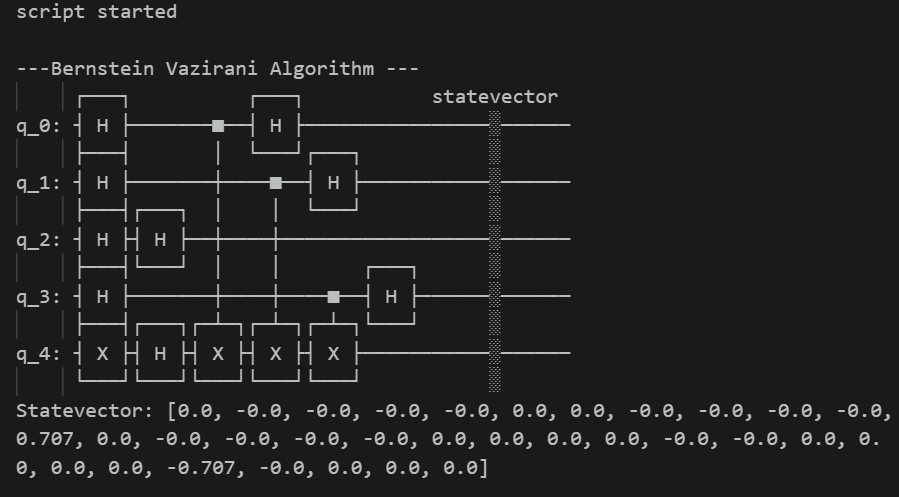

# Bernstein-Vazirani Algorithm

## Problem
Given a hidden secret string $s$, find it using as few queries as possible.

- **Classically:** requires $n$ queries (one per bit)
- **Quantum:** requires only **1 query** regardless of $n$

## How it Works

The algorithm finds the secret string $s$ by exploiting **phase kickback**.

The oracle computes:
$$|x\rangle|y\rangle \rightarrow |x\rangle|y \oplus f(x)\rangle$$

Where $f(x) = s \cdot x \mod 2$ (bitwise dot product).

### Circuit Steps
1. Initialize ancilla to $|1\rangle$ using X gate
2. Apply H to all qubits → ancilla becomes $|-\rangle$
3. Apply oracle (CNOT where secret bit is 1)
4. Apply H to input qubits again
5. Measure → result is the secret string $s$

### Why CNOT = Phase Kickback?
When the target qubit is in $|-\rangle$ state:
$$\text{CNOT}|+\rangle|-\rangle \rightarrow |-\rangle|-\rangle$$

The phase is **kicked back** to the control qubit instead of flipping the target!

## Example
Secret string: $s = 1011$

After the algorithm, measuring the input qubits directly gives **1011**.

## Output
Non-zero amplitude at index 11 = **1011** in binary 


## How to Run
```bash
pip install qiskit qiskit-aer numpy
python "Bernstein Vazirani.py"
```

## Requirements
- Python 3.8+
- Qiskit
- Qiskit-Aer
- NumPy